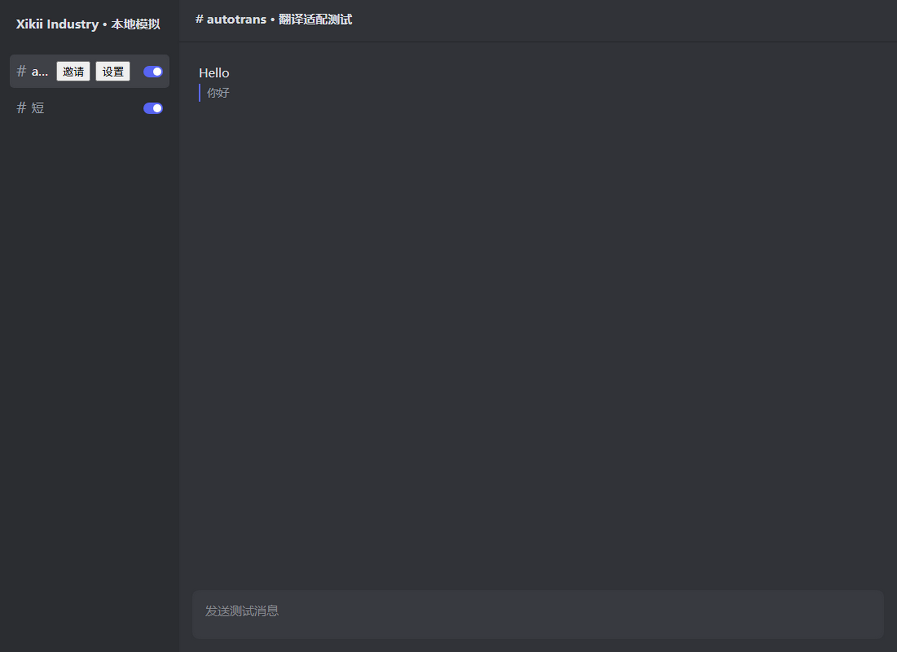
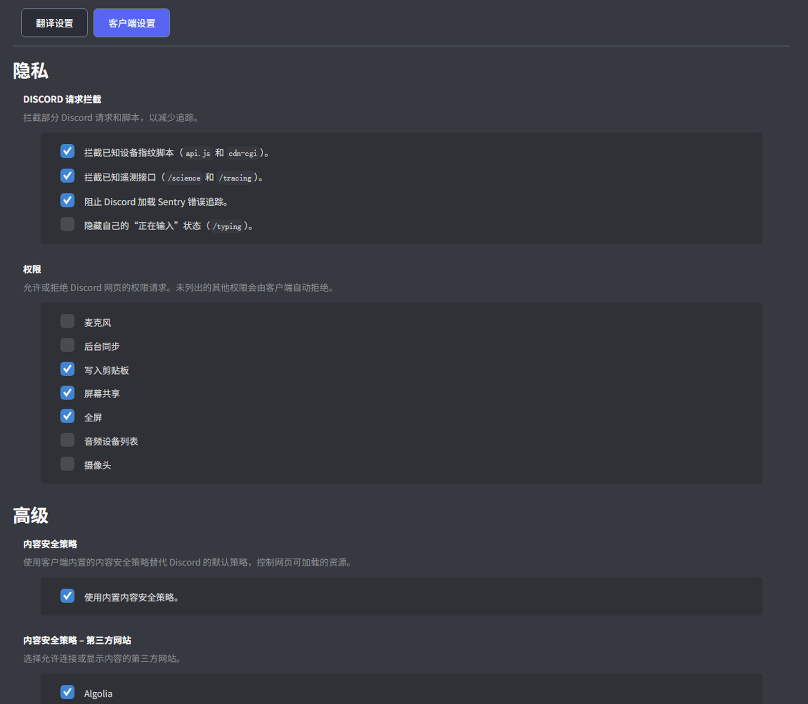

# XIKII Discord Case

基于 [WebCord](https://github.com/SpacingBat3/WebCord) 的 Discord 桌面客户端，集成阿里云通义千问 **Qwen**，支持中文与英文双向翻译。

收到英文消息，在原文下方阅读中文译文；输入中文，按 Enter 翻译为英文并发送。频道和私信名称旁各有独立开关，无需预览窗口或底部工具栏。

**当前版本：0.1.3 Windows x64 测试版。** 基础翻译、发送已由用户在真实频道和私信中验证；最新 Discord 富文本、开机启动、实际通知及安装卸载仍待完整人工验收。

[下载测试版](https://github.com/XikiiMaker/XIKII-Discord-Case/releases/tag/v0.1.3) · [报告问题](https://github.com/XikiiMaker/XIKII-Discord-Case/issues) · [验证记录](docs/validation.md)

## 功能

- **中英互译**：接收译为中文，默认发送译为英文，也可选择中文发送目标。
- **独立开关**：私信默认开启、频道默认关闭；须先配置 Key 并确认启用。开关固定在列表右侧，选中或悬停时不移位。
- **简洁中文界面**：移除顶部菜单栏、预览和底部工具栏；客户端设置及提示使用简体中文，译文行距统一。
- **直接发送**：保护 Markdown、代码、链接、提及与表情；翻译失败或草稿改变时停止自动发送。
- **可配置的 Qwen**：自备 DashScope API Key，选择地域、模型、发送语言和流式显示。
- **成本控制**：LRU 缓存、重复请求合并、并发队列、按会话隔离的上下文。上下文默认关闭。
- **桌面功能**：保留登录会话，可选开机启动，桌面通知设置、任务栏闪烁和托盘未读提示。
- **备用引擎**：可选自行配置的 LibreTranslate 服务，默认关闭；见 [说明](docs/fallback.md)。



*截图使用人工数据展示布局，不含真实聊天记录。*

## 安装与使用

1. 在 [Releases](https://github.com/XikiiMaker/XIKII-Discord-Case/releases) 下载 Windows x64 ZIP，完整解压后运行 `xikii-discord-case.exe`。也提供 EXE/MSI 安装包供测试。
2. 登录自己的 Discord 账号。升级前请从托盘彻底退出旧版，避免单实例机制唤起旧程序。
3. **右键频道或私信 → 翻译设置**，选择与 Key 一致的地域、模型，填写自己的 DashScope API Key，阅读并确认启用提示。托盘右键菜单也可以打开设置。
4. 打开名称旁的开关，即可接收中文译文、发送英文译文；关闭后恢复普通聊天。

| 操作 | 行为 |
| --- | --- |
| Enter | 开关开启时翻译并发送，关闭时普通发送 |
| Shift + Enter | 换行 |
| Ctrl + Enter | 直接发送原文 |
| Ctrl + Alt + T | 切换当前会话翻译 |
| 右键频道或私信 | 调整翻译状态、目标语言或打开设置 |

在设置窗口切换到「客户端设置」，可调整开机启动和通知。开机启动默认关闭。登录通过本地持久化会话保持，不另外保存密码；主动登出或 Discord 使会话失效后仍需重新登录。



## 数据与密钥

开启翻译后，待翻译文字会发送至所选阿里云服务；启用上下文后，最近的会话文字也会一并发送。Qwen 使用你自己的额度，费用由服务商收取。

API Key 仅在 Electron 主进程使用，通过 `safeStorage` 加密保存在本机，不向 Discord 页面暴露。缓存与上下文在内存中管理。备用引擎独立配置，不接收 Qwen Key 或对话上下文。

请勿在 Issue 或提交中上传 API Key、登录数据或真实聊天记录。本项目与 Discord、阿里云没有官方关联；Discord 页面更新可能需要客户端适配。

## 本地开发

当前验证环境：Windows x64、Node.js 24、Electron 43。其他操作系统暂未验证。

```powershell
npm ci
# 如果尚未下载 Electron 二进制：
node node_modules/electron/install.js
npm test
npm start
```

```powershell
# 完全本地的页面、编辑器及会话保存测试
npm run test:electron
npm run test:slate
npm run test:session

# 构建 Windows ZIP、EXE 和 MSI
$env:WEBCORD_BUILD='release'
npm run make -- --platform win32 --arch x64
```

本地验证覆盖 TypeScript、47 项 Node/DOM 测试、29 项 Electron 页面场景、7 项 Slate/React 编辑器场景及跨进程会话保存。自动化使用人工数据和模拟翻译服务，不发送真实 Discord 消息。远端 CI 尚未启用，模板见 [docs/ci.yml.example](docs/ci.yml.example)。

架构：Discord 页面 / preload → 窄接口 IPC → Electron 主进程 → 翻译队列、缓存与上下文 → Qwen / DashScope。密钥管理与网络调用集中在主进程。

## 文档与贡献

- [需求与默认行为](docs/requirements.md)
- [实现进度和待验证项](docs/implementation-plan.md)
- [Windows 测试步骤](docs/windows-test.md)
- [验证记录](docs/validation.md)
- [上游版本及来源](docs/upstream.md)

欢迎提交 Issue 和 Pull Request。请说明版本、复现步骤、预期与实际行为；翻译复现使用人工文字即可。修改后运行相关测试，并说明是否经过真实 Discord 验证。

## 开源许可证

本项目采用 **[MIT 许可证](LICENSE)**，允许在许可证条件下使用、修改与分发。基于 WebCord 4.14.0 开发，完整保留上游许可证与版权声明，感谢 [SpacingBat3 / WebCord](https://github.com/SpacingBat3/WebCord) 及其贡献者。目前保留上游应用图标。第三方依赖遵循各自许可证。
