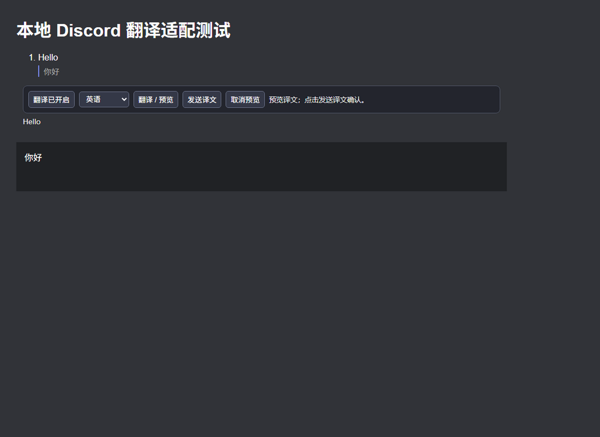

# 开发验证记录

日期：2026-09-11，Windows x64，Node 24.15.0。

## 已完成

- `npm test`：TypeScript 编译、16 项 Node/DOM 测试和 oxlint。
- GitHub CI 尚未启用：当前 CLI 缺少 workflow 写入权限，配置模板见 `ci.yml.example`。
- `npm run test:electron`：实际 Electron 主进程、隔离 preload、可信设置页和 Chromium 输入事件联调，使用本地 HTTPS fixture，不访问真实 Discord 或 Qwen。
- 模拟联调验证：safeStorage 密钥加密、接收译文、预览保留草稿、设置保存、自动发送恰好一次、修改草稿不发送、切换会话不发送、会话隔离。
- UI 证据输出位置：`cache/evidence/`，属于本地构建产物，不提交包含运行数据的目录。

已检查的模拟界面截图（仅含测试文字）：




## 必须区分的验证边界

模拟输入框是原生 contenteditable，不包含 Discord 的实际 Slate/React 运行代码。因此这些结果证明本地流程和 IPC 能协作，不等于真实 Discord 兼容性已通过。

真实 DashScope Key 尚未配置，没有产生真实 API 测试费用；模型可用性、翻译质量及响应速度仍需真实联调。没有向真实联系人发送测试消息。

## 重现

```powershell
npm ci
# 若 npm 的脚本许可机制没有安装 Electron 二进制：
node node_modules/electron/install.js
npm test
npm run test:electron
```

下载依赖遇到网络问题时，按本机已有代理为当前终端配置 `HTTPS_PROXY` / `HTTP_PROXY`；Electron 下载还可能需要 `ELECTRON_GET_USE_PROXY=1`。不要把代理账号、API Key 或登录数据写入仓库。
