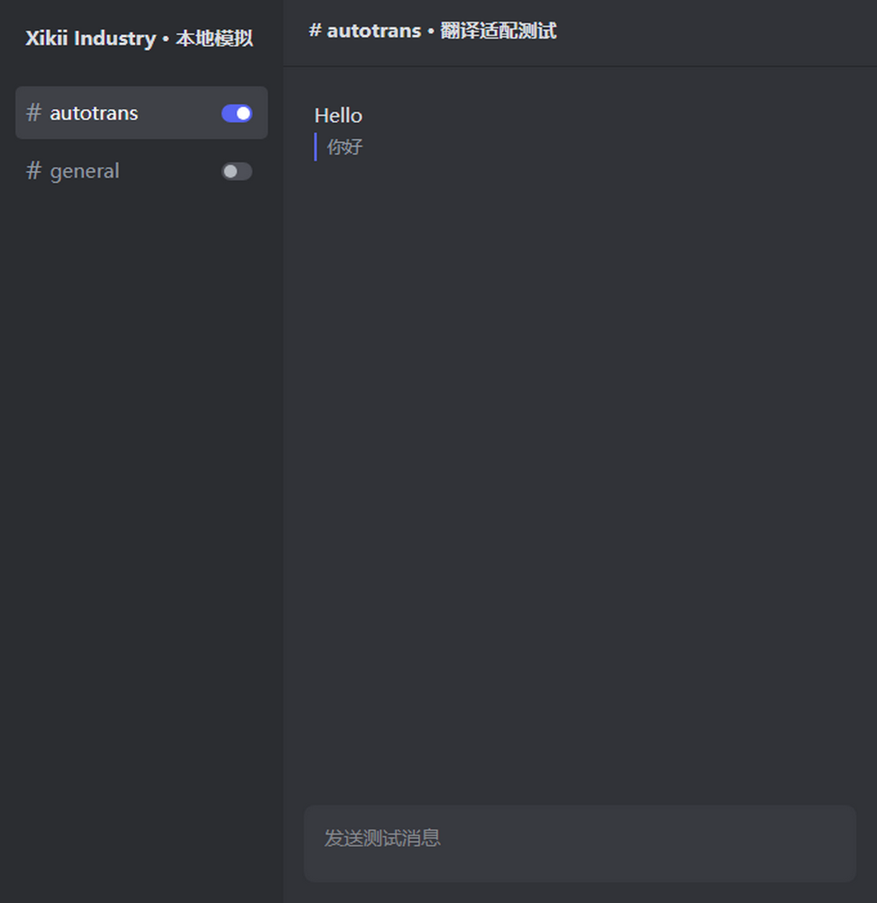
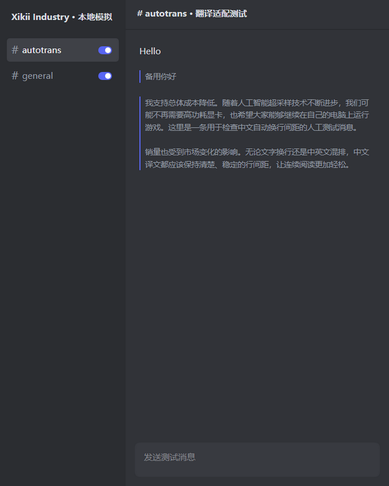
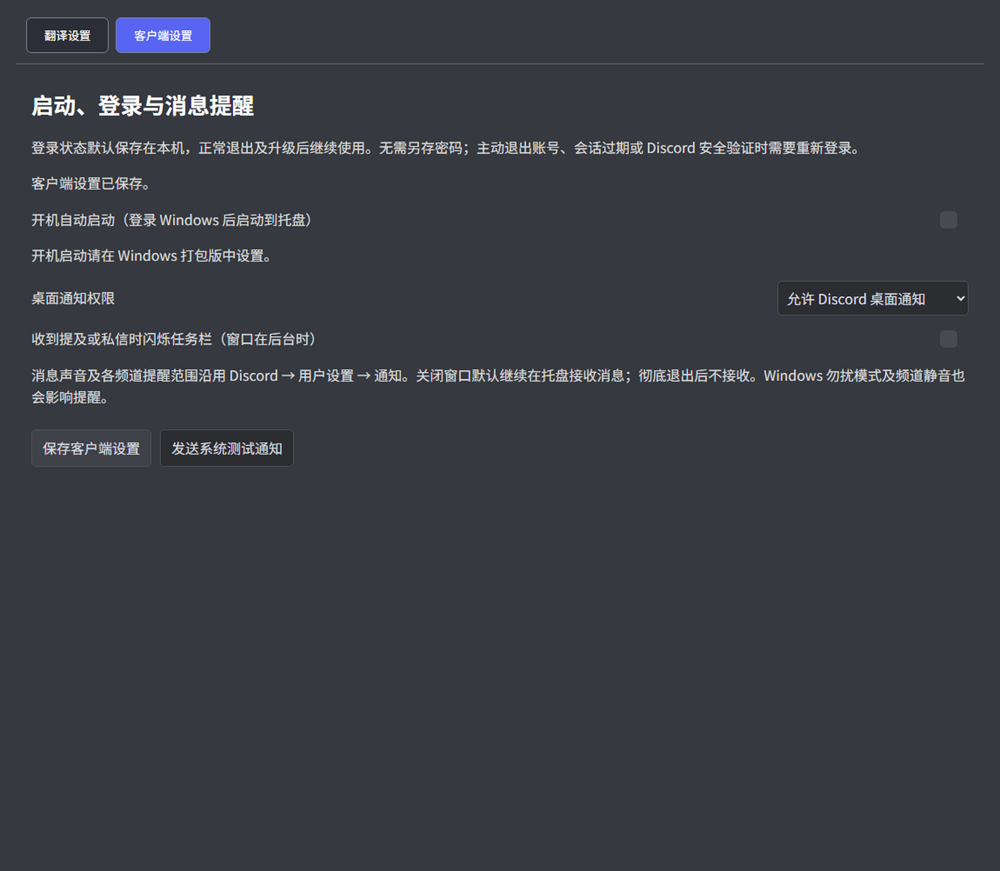
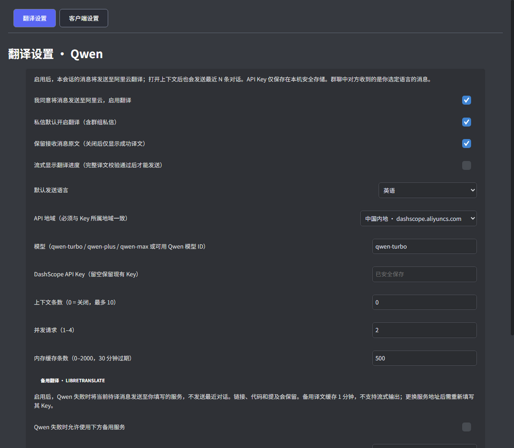

# 开发验证记录

日期：2026-09-11，Windows x64，Node 24.15.0。

## 已完成

- `npm test`：TypeScript 编译、39 项 Node/DOM 测试和 oxlint。
- GitHub CI 尚未启用：当前 CLI 缺少 workflow 写入权限，配置模板见 `ci.yml.example`。
- `npm run test:electron`：实际 Electron 主进程、隔离 preload、可信设置页和 Chromium 输入事件联调，使用本地 HTTPS fixture，不访问真实 Discord 或 Qwen。
- 模拟联调验证 27 项：密钥安全存储、直接发送、流式与原文显示、频道开关及非当前频道点击不跳转、草稿/路由防误发、备用引擎与独立密钥、宽窄窗口无遮挡、中文行高、客户端通知设置保存等。证据：`cache/evidence/smoke-result.json`。
- 两个 Electron 进程验证人工 Cookie 和 localStorage 在正常退出重启后保留，未读取真实账号数据。证据：`cache/evidence/session-persistence.json`。
- 开机启动注册、取消、开发版限制、通知快捷方式标识及测试通知点击恢复窗口使用隔离 OS 适配测试；未更改用户的开机启动项。
- UI 证据输出位置：`cache/evidence/`，属于本地构建产物，不提交包含运行数据的目录。
- Windows x64 ZIP、Squirrel EXE/MSI 已构建。已检查 ASAR 包含中英翻译模块且排除测试与运行缓存；上游更新关闭。打包程序 `--version` 返回 `XIKII Discord Case v0.1.1, stable build`，退出码 0。此检查不替代真实登录与干净环境安装/卸载验收，操作步骤见 [Windows 测试说明](windows-test.md)。

已检查的模拟界面截图（仅含测试文字）：









## 必须区分的验证边界

模拟输入框是原生 contenteditable，不包含 Discord 的实际 Slate/React 运行代码。因此这些结果证明本地流程和 IPC 能协作，不等于真实 Discord 兼容性已通过。

真实 DashScope 已使用用户授权的 Key，仅发送人工测试文字，累计使用 10/20 次请求。当前 qwen-turbo 的三项中英测试均通过；每项重复请求命中缓存，没有增加 API 调用。以下延迟为本机该次测试观察值，不是性能保证。

| 场景 | 实际结果 | 总耗时 / 首段 |
| --- | --- | --- |
| 英译中，含 Markdown、URL、代码 | `**你好！** 访问 https://example.com 并保持 \`USB-C\` 不变。` | 752 ms / 非流式 |
| 中译英，参考键盘上下文 | `它支持蓝牙吗？` → `Does it support Bluetooth?` | 357 ms / 285 ms |
| 英译中，参考电脑机箱上下文 | `When will the XIKII case ship?` → `XIKII 机箱什么时候发货？` | 400 ms / 309 ms |

测试中曾发现模型把背景一起译出的缺陷；已将背景与最后待译消息分离，并复测上述三个场景。该修复不代表任意输入的模型输出都能保证正确。

工具没有向真实 Discord 联系人发送测试消息。用户已在真实频道及私信中测试普通文本翻译和发送，并报告翻译基本准确、功能基本实现。0.1.1 根据截图修正 UI。最新开关布局、真实通知的横幅/声音/跳转、实际 Windows 开机启动及结构化 Slate 输入仍需人工复核；本地模拟通过不替代这些结果。

Windows 通知快捷方式与 AppUserModelID 按 [Electron 官方通知文档](https://www.electronjs.org/docs/latest/tutorial/notifications) 配置；启动项使用 [app 登录启动设置](https://www.electronjs.org/docs/latest/api/app#appsetloginitemsettingssettings-macos-windows)，退出刷新 Chromium 的持久存储。Discord 的通知范围及消息声音仍由其原生通知设置控制。

## 重现

```powershell
npm ci
# 若 npm 的脚本许可机制没有安装 Electron 二进制：
node node_modules/electron/install.js
npm test
npm run test:electron
```

下载依赖遇到网络问题时，按本机已有代理为当前终端配置 `HTTPS_PROXY` / `HTTP_PROXY`；Electron 下载还可能需要 `ELECTRON_GET_USE_PROXY=1`。不要把代理账号、API Key 或登录数据写入仓库。
